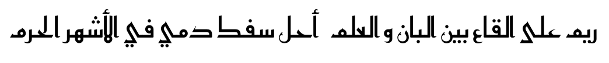

Reem Kufi
=========

Reem Kufi is a Fatimid-style decorative [Kufic] [1] typeface as seen in the
historical mosques of Cairo. Reem Kufi is based on the Kufic designs of the
great Arabic calligrapher [Mohammed Abdul Qadir] [2] who revived this art in
the 20th century and formalised its rules.

Reem is an Arabic female name that literaly means “a white deer” and it so
happens to be the name of my daughter.

[1]: https://en.wikipedia.org/wiki/Kufic
[2]: https://ar.wikipedia.org/wiki/%D9%85%D8%AD%D9%85%D8%AF_%D8%B9%D8%A8%D8%AF_%D8%A7%D9%84%D9%82%D8%A7%D8%AF%D8%B1_%D8%B9%D8%A8%D8%AF_%D8%A7%D9%84%D9%84%D9%87_%28%D8%AE%D8%B7%D8%A7%D8%B7%29
