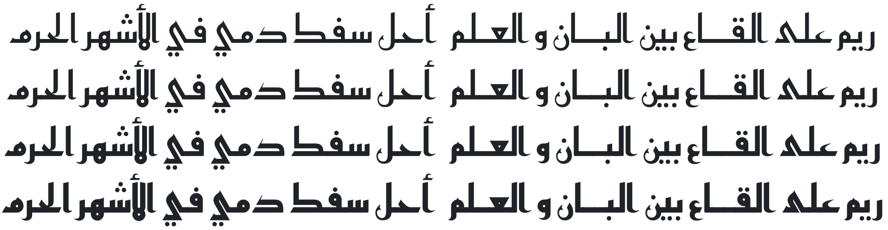

Reem Kufi
=========

Reem Kufi (كوفي ريم) is a [Kufic][1] typeface based on early Kufic (Mushafi) models, but
retrofitted to the Fatimid Kufic grid and with borrowing from its forms. Reem
Kufi is largely based on the Kufic designs of the late master of Arabic
calligraphy [Mohammad Abdul Qadir][2] who revived this art in the 20th century
and formalised its rules.

Reem Kufi is particularly suitable for display settings, in titles or
decorations. Due to its unmistakable old Kufic style, it gives a feeling of
something old, historical, or Islamic.

Some glyphs in Reem Kufi has several alternate variants that can work better
for different situations, they can be accessed with “Character Variant”
features (`cv01`, `cv02`, and so on).

Reem is an Arabic female name that literally means “a white deer” and it so
happens to be the name of my daughter.

Installation
------------

Reem Kufi comes in two flavours, a [variable font][3] that has all the font
styles in the same file, and allow dynamic changes of the font weight, and a
set of static instances for specific font weights.

The variable font file is `ReemKufi.otf` and the static instances has the style
as part of the file name (e.g. `ReemKufi-Regular.otf`). It is not recommended
to install both variable font and the static instances at the same time, as it
would confuse some applications. You should install either of them based on the
degree of variable font support in the software you use.

[1]: https://en.wikipedia.org/wiki/Kufic
[2]: https://ar.wikipedia.org/wiki/محمد_عبد_القادر_عبد_الله_(خطاط)
[3]: https://web.dev/variable-fonts
